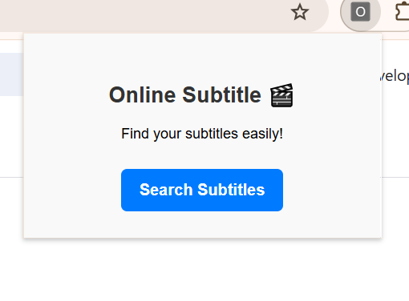

# Online Subtitle Extension 🎬 (v1.0)

A simple and easy-to-use browser extension designed to help you find online subtitles effortlessly. This is the initial release (Version 1.0).

## 🌟 Features
* Clean and user-friendly interface.
* Fast and lightweight performance.

## 📸 Screenshots

## 🚀 How to Install

1. Download the code from this repository (Click the green **Code** button > **Download ZIP**).
2. Extract the downloaded ZIP file to your computer.
3. Open your web browser and navigate to the Extensions page (e.g., type `chrome://extensions/` in the URL bar).
4. Enable **Developer mode** using the toggle at the top right corner.
5. Click the **Load unpacked** button and select the folder you just extracted.
6. The extension is now installed and ready to use!

## 🛠️ Built With
* HTML
* CSS
* JavaScript
